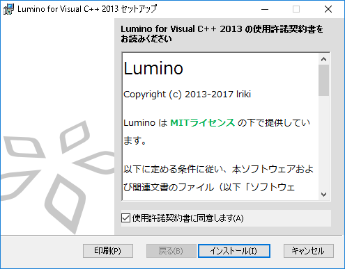

開発環境の準備
====================

必要なソフトウェアをインストールする
--------------------
### Visual Studio のインストール
[Visual Studio の Web ページ](https://www.visualstudio.com/ja-jp/downloads/download-visual-studio-vs#DownloadFamilies_2) から Visual Studio をダウンロードし、インストールしてください。

Lumino は以下のバージョンに対応しています。
- Visual Studio 2013
- Visual Studio 2015
- Visual Studio 2017

### DirectX エンドユーザーランタイムのインストール
[DirectX エンドユーザーランタイムのダウンロードページ](http://www.microsoft.com/ja-jp/download/details.aspx?id=35) から 「DirectX エンド ユーザー ランタイム Web インストーラ」をダウンロード、インストールしてください。


Lumino をインストールする
--------------------
[Lumino のダウンロードページ](http://nnmy.sakura.ne.jp/lumino/download.html) からインストーラをダウンロードし、実行してください。

インストーラの指示に従ってインストールを行います。




プロジェクトを作成する
--------------------
1. Visual Studio を起動し、メニューから [ファイル] > [新規作成] > [プロジェクト] を選択します。
2. 表示された [新しいプロジェクト] ダイアログの [テンプレート] > [Visual C++] の一覧にある [Lumino Project] を選択します。
3. プロジェクト名を入力して、[OK] をクリックします。


プログラムを実行してウィンドウを表示する
--------------------
最初からプロジェクトに含まれている Main.cpp には画像を表示するプログラムが書かれていますが、
このセクションでは Lumino を動かすための最も短いコードで、基本的な流れを説明します。


```cpp
#include <Lumino.h>
using namespace ln;

void Main()
{
	// Lumino の初期化処理
	Engine::Initialize();

	// Lumino の更新処理
	while (Engine::Update())
	{
	}

	// Lumino の終了処理
	Engine::Terminate();
}
```

実行すると、次のようなウィンドウが表示されます。


### Main 関数
Lumino のエントリーポイントは Main 関数です。
プラットフォームごとのエントリーポイントの隠蔽や、C++ の例外処理などをスムーズに行うため、独自のエントリーポイントを使用します。
(main ではありませんので注意してください。通常の main 関数を使用することもできますが、本チュートリアルでは触れません)


### 初期化処理
```
Engine::Initialize();
```

Engine クラスの Initialize 関数を呼び出すことで、Lumino の機能を使用するために必要な初期化処理を行います。
初期化に成功するとウインドウが表示されます。


### 更新処理
```
while (Engine::Update())
{
}
```
このループは、ウィンドウが閉じられるまでの間、1秒間に60回の周期で実行され続けます。
Engine::Update() はウインドウが閉じられていなければ true を返し、ウインドウ右上の×ボタンを押すなどで閉じられた場合は false を返します。

このループ1回のことを「フレーム」と呼び、この中に
- プレイヤーの入力を確認し、
- キャラクターを移動し、
- ウィンドウに絵を描く
といったプログラムを書くことでゲームを進行させます。


### 終了処理
```
Engine::Terminate();
```
ウィンドウが閉じられ、while ループを抜けた後は Lumino の終了処理を行います。


アンインストール
--------------------
コントロールパネルの「プログラムのアンインストール」から該当バージョンをアンインストールしてください。
